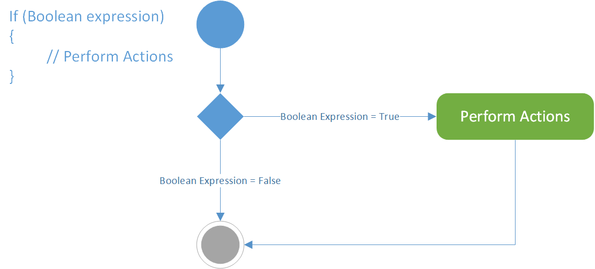
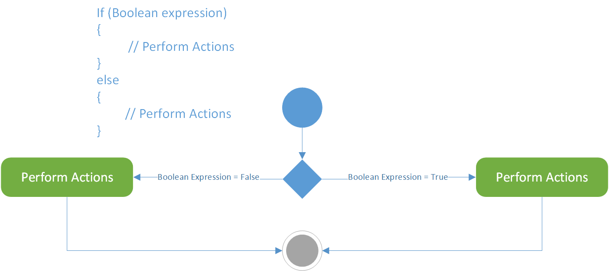
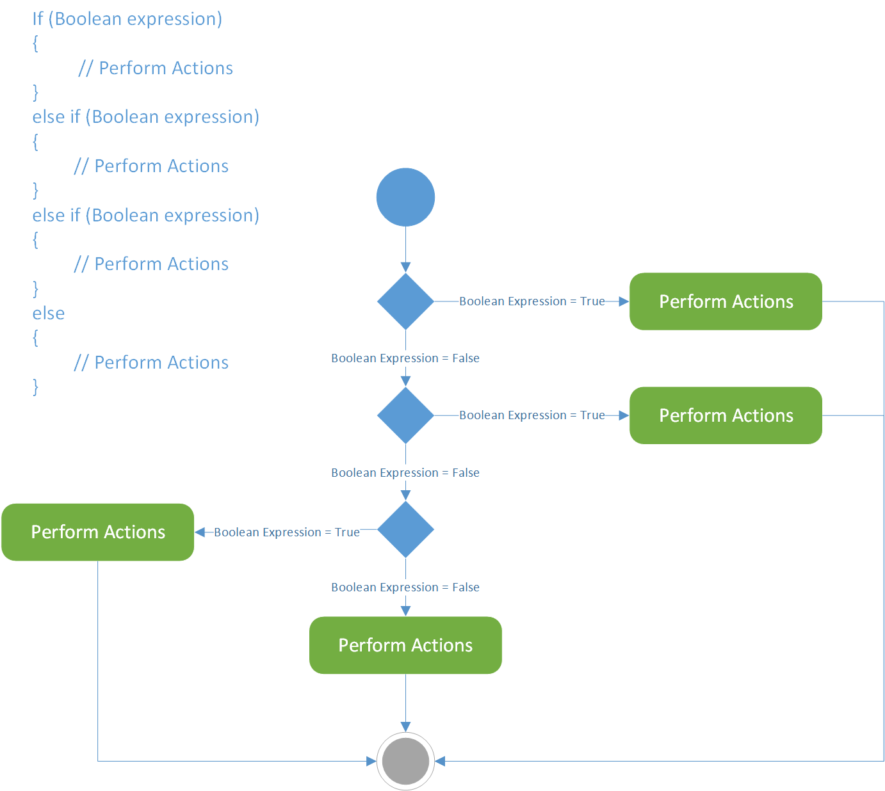
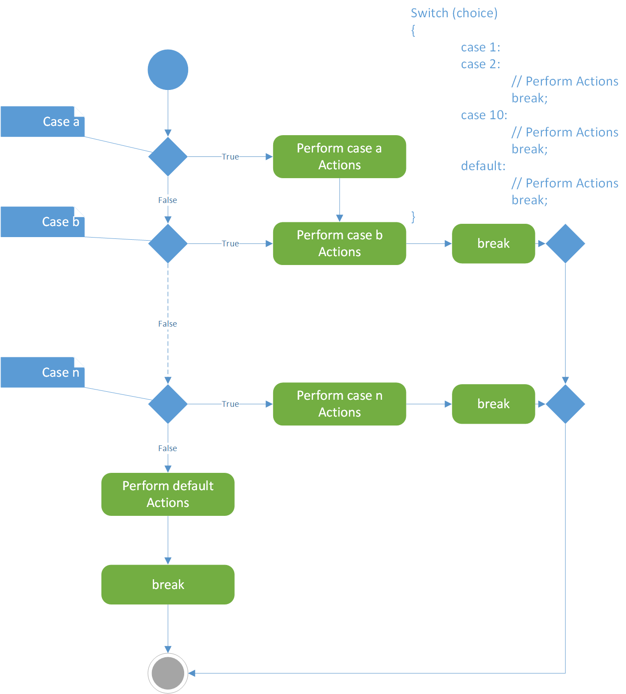
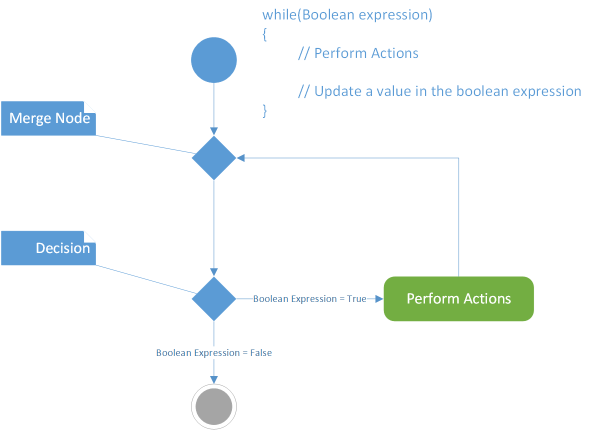
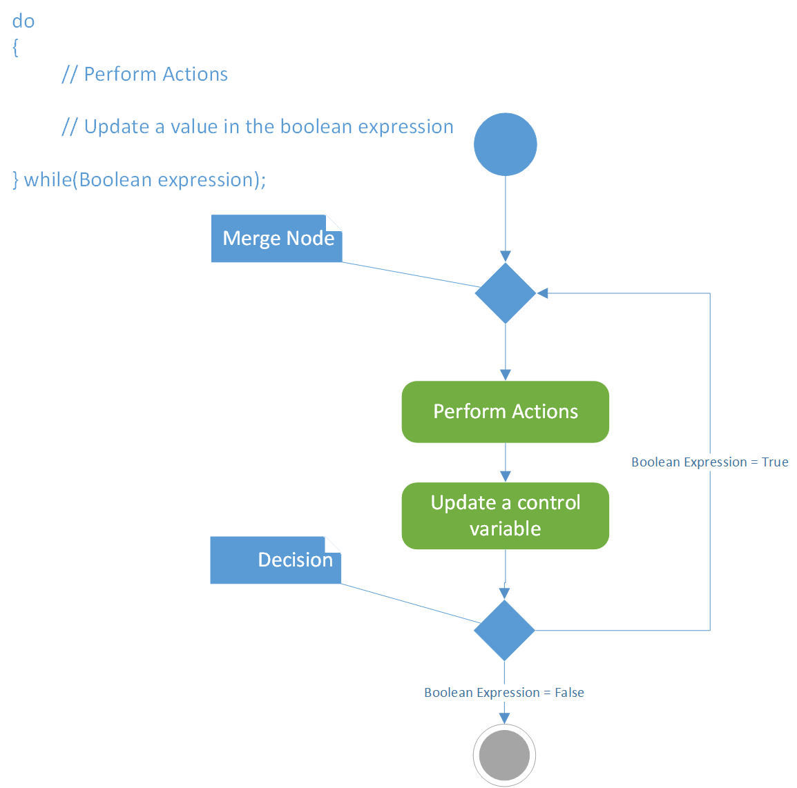
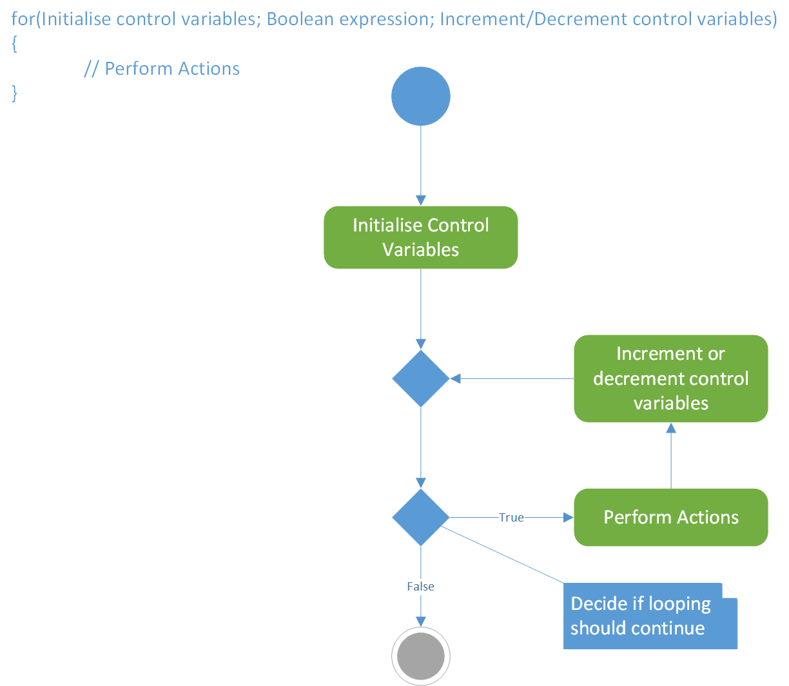

# Recap

## Revision
The purpose of revision is not just to remember what you have done previously. Revision helps you understand what you could not on a first pass of a material, it helps you identify concepts and material you did not see before, it helps you deepen your knowledge on a subject matter and of course it helps you remember.

### UML Activity Diagrams
Unified Modeling Language is used frequently in the industry to portray and visualise system characteristics of software. It is usually the job of system designers to design software using UML diagrams to portray concisely how a software is going to be organised and look at the different aspects before coding. UML is independent of programming language and thus it used widely on other areas as well. There numerous diagrams that UML support from class diagrams to system diagrams and activity diagrams, which we are going to briefly describe here.

Activity diagrams represents a workflow or activity of a part of a software system. When describing an algorithm or part of an algorithm it is essential to make and use simple symbols in order to quickly comprehend the operation. In activity diagrams you have two small circles that represent the initial state of the system and the end state of the workflow. The end usually is represented with two circles one inside the other, where the inner most circle is solid. The start is a single simple filled in (solid) circle. 

Between these two circles there are actions which are represented by an elongated circle with text. All of these are then connected with arrows called transitions. The transitions indicate the flow of an activity. Sometime a square with notes inside it will appear within activity diagrams to signify notes.

### Variables
When creating any variable this really means that you are creating a memory location. Where exactly it is stored depends on the variable type and memory availability of the computer where the program is running on. It is important to understand that anything you create in your program has to be stored somewhere when your application runs. This will help you create better applications and write better code.

#### Scalar and Arrays {-}

### Operators

### Control Structures
Usually when you read a book or even this document you read line after line sequentially. In programming languages this is also the case, you write a series of commands and one follows the next. In real life or in books sometimes you will find statements that state that you might like to skip a part if something is satisfied or not or you might keep repeating the same section or revisit the same section. This is also true with our everyday lives. We wake up and we have to decide if we are going to wear the black socks or the red socks, we need to make our breakfast which we need to decide what are we going to have. Of course this is repeated mostly everyday.

In C# to achieve what we do in our everyday life, making decisions, repeating a process there are 3 types of control structures. Sequential structures, selection structures and iteration structures. 

Sequential structure is already defined in C# by the compiler so we do not really have to do anything, besides knowing that one statement of code will be followed by another.

The selections structures that C# provides us are three. We shall now look at each one individually.

#### Single Selection

To chose an alternative course of action if something is satisfied within a program you would need to use an if statement. A simple example would be the pass grade of each module is 40%, so if you want to write a simple program that takes an input of your final mark and then outputs if you have passed only, you would probably write something like this:

```
  if (input_mark >= 40)
  {
    Console.write("Passed")
  }
```

```{r, out.width='100%', fig.align='center', fig.cap='Client data model', echo=FALSE}

```

#### Double Selection

To chose between a choice and alternative you can use the double selection contro sturcture of if..else
A simple example would be the pass grade of each module is 40%, so if you want to write a simple program that takes an input of your final mark and then outputs if you have passed or failed, you would probably write something like this:

```
  if (input_mark >= 40)
  {
    Console.write("Passed")
  }
  else
  {
    Console.Write("Failed")
  }
```

```{r, out.width='100%', fig.align='center', fig.cap='UML Activity Diagram for a Double Selection Statement', echo=FALSE}

```

#### Nested Selection

To chose between multiple choices more than 2 you can use the a nested selection control structure of if..elseif..else.
Taking our simple example for passing you could increase it complexity by including the final mark category. A sample nested selection would probably write something like this:

```
  if (input_mark >= 40 && input_mark < 50)
  {
    Console.write("Passed with a 3rd")
  }
  elseif (input_mark >= 50 && input_mark < 60)
  {
    Console.write("Passed with a 2.ii")
  }
  elseif (input_mark >= 60 && input_mark < 70)
  {
    Console.write("Passed with a 2.i")
  }
  elseif (input_mark >= 70)
  {
    Console.write("Passed with a First")
  }
  else
  {
    Console.Write("Failed")
  }
```
The activity diagram for a nested if statement can be seen below:

```{r, out.width='100%', fig.align='center', fig.cap='UML Activity Diagram for a Nested If statement', echo=FALSE}

```

The activity diagram for a nested switch statement can be seen below:

```{r, out.width='100%', fig.align='center', fig.cap='UML Activity Diagram for a nested switch statement', echo=FALSE}

```

The activity diagram for a while iteration statement can be seen below:

```{r, out.width='100%', fig.align='center', fig.cap='UML Activity Diagram for a while Statement', echo=FALSE}

```

The activity diagram for a do..while iteration statement can be seen below:

```{r, out.width='100%', fig.align='center', fig.cap='UML Activity Diagram for a do..while Statement', echo=FALSE}

```

The activity diagram for a for iteration statement can be seen below:

```{r, out.width='100%', fig.align='center', fig.cap='UML Activity Diagram for a for Statement', echo=FALSE}

```

### Methods and Modular Programming

## Software Development

### Creating or opening an application
How would you create an application what do you need to know before you create one?

###	Software Development Lifecycle

###	Intellectual Property

###	Referencing

