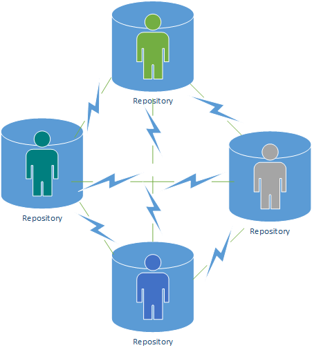

# Recap

## Module Structure

## Revision
This lab will go back and revise on certain areas that would help us understand the module this year. Looking back to the 

## Software Development

###	Software Development Lifecycle

###	Intellectual Property

###	Referencing

##	Version Control
While developing software, development teams use tools to help them reduce development times and produce more stable and better solutions.
The most popular of these are version control or source control tools. The aim of these tools is to keep a record of all changes that happen on the source code of an application or applications being developed.

A version control tool keeps a record of all changes while recording the person or team responsible, the time of a change and the content that has been altered. All of these are recorded in a specialised database usually called a repository or repo for short, that can be accessed at any point to review code and provide a fix or an addition to the source code by identifying the best place, time and/or person to do so.

Try and remember how many times have you lost work that you wish you have backed up or you have but you do not remember where it is located, or you have not backed up as frequently as you would have wanted with the specific change you are looking. All of these cases would disappear or be minimised by using a version control tool and having a repository to store all your changes. 

In this module you will learn how to use one of the most popular version control tool. Before we go on to play and start creating or obtaining repositories let us see the types of repositories that exist.

### Client based model
A single repository exists that users connect and exchange information. The repository is centralised and all repository functions are done centrally. The users connect and obtain a working copy of the repo. The users have the ability to change the source files but any changes to the repository would need to be communicated directly to the central repository.

```{r, out.width='60%', fig.align='center', fig.cap='Client data model', echo=FALSE}
knitr::include_graphics('images/Client Data Model Example.png')
```

### Distributed based model

```{r, out.width='60%', fig.align='center', fig.cap='Distributed data model', echo=FALSE}

```

##	Git and GitHub

### Beyond Source Code