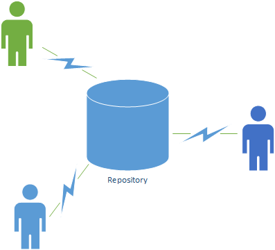
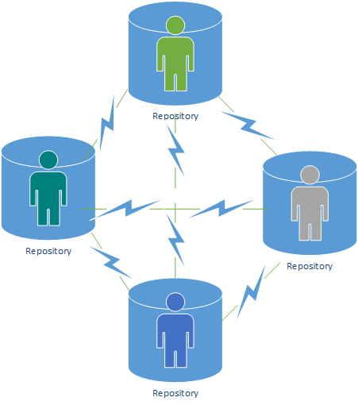

--- 
title: "Application Development MCOMD1ADC"
author: "Dr. Alexios Louridas"
date: "`r Sys.Date()`"
site: bookdown::bookdown_site
documentclass: book
bibliography: [book.bib, packages.bib]
biblio-style: apalike
link-citations: yes
description: "This is a minimal example of using the bookdown package to write a book. The output format for this example is bookdown::gitbook."
---

# Introduction {-}

## Module Structure {-}

We are going to have 12 weeks of teaching. What we would like at the end of this module is for you to be able to create a software application from scratch. From an idea to developing and maintaining it.

To achieve this we are going to introduce tools that would help you in developing software followed by introducing concepts to help you organise your ideas. We then going to look at developing the application front end(graphical user interface) and back end. Last you will be introduced to testing and application management for easy maintaining your software application. 

The indicative schedule we are going to follow can be seen in table 0.1. Although we shall try and follow this schedule it all depends on you. If you believe that you need an extra session to describe and master something then we are here to listen. Please tell us and we shall try to change it accordingly.

```{r echo = FALSE}
c<- matrix(c(0,1,2,3,4,5,6,7,8,9,10,11,"Version Control","Revision","Introduction to Classes - Basics","Arrays and Collections","Objects and Structures","Algorithms","GUI and Forms","Methods Again","Errors and Exceptions","Testing and Data Validation","File System","Summary and Revision"),ncol=2)
colnames(c) <- c("Session","Indicative Content")

knitr::kable(c,
  caption = 'Indicative Content Schedule.',align = "cc", booktabs = FALSE
)
```

## Assignment {-}

##	A. Version Control {-}
While developing software, development teams use tools to help them reduce development times and produce more stable and better solutions.
The most popular of these are version control or source control tools. The aim of these tools is to keep a record of all changes that happen on the source code of an application or applications being developed.

A version control tool keeps a record of all changes while recording the person or team responsible, the time of a change and the content that has been altered. All of these are recorded in a specialised database usually called a **repository** or repo for short, that can be accessed at any point to review code and provide a fix or an addition to the source code by identifying the best place, time and/or person to do so.

Try and remember how many times have you lost work that you wish you have backed up or you have but you do not remember where it is located, or you have not backed up as frequently as you would have wanted with the specific change you are looking. All of these cases would disappear or be minimised by using a version control tool and having a repository to store all your changes. 

In this module you will learn how to use one of the most popular version control tool. Before we go on to play and start creating or obtaining repositories let us see the types of repositories that exist.

### Local based model {-}
The simplest way of having version control is to keep multiple copies of the same file at different stages of its development. You try to keep versions by changing the filename appropriately or keeping track of the last time modified. Although, simple it is associated with a lot of errors and large disk space. 

To improve this method some decided to create a small database to track changes of the files under version control.
If you know a version control system called RCS you probably are a bit older. This system kept the database on a special section of your hard drive, thus at any point you wer able to go back and recreate the files at specific times.

### Client based model or centralised systems{-}
A single repository exists that users connect and exchange information. The repository is centralised and all repository functions are done centrally. The users connect and obtain a **part** of the working copy of the repo. The users have the ability to change the source files but any changes to the repository would need to be communicated directly to the central repository.

```{r, out.width='60%', fig.align='center', fig.cap='Client data model', echo=FALSE}

```

One of the main disadvantage of these system is that it has a single point of failure. If the server that contains the repository goes down then collaboration and version control does not work arnymore.

### Distributed based model {-}
Each user has a working **full** copy of the repository. Each user can make changes to the repository locally and thus work offline if required. Once back online the users can distribute all changes to the repository where all users would then have access to view.  
```{r, out.width='60%', fig.align='center', fig.cap='Distributed data model', echo=FALSE}

```

## B.	Git and GitHub
Git is a distributed version control system that has approximately 90% usage in the industry. The main reason of its popularity is its performance compared to its competitors. It provides an outstanding flexibility and security and everything is inbuilt and free.
In addition to Git advantages, because of its popularity there are many third party software tools and services that have integrated with Git including IDEs such as visual studio, issue and project tracking software, such as Jira, and code hosting services like GitHub.

### How does Git Work

To start understanding what git provides let us look at the following scenario:

A software application is being developed and it is currently in version 1.5 and the developers are working on version 2.0.
Eventually the development finishes and version 2.0 is released. A customer though does not want to go to version 2.0 as they do not have a budget to support the update, but they would like a feature that they have seen in version 2.0 to be included in their version of their software (1.5). 

The developers only have to go to Git history and "copy" the required change associated with the feature needed and add it to the release version of 1.5 and thus create a new release 1.5.1.
No new code really needed to be developed for what the customer needed.

From this example you can see that Git offers flexibility to control your changes and releases without time constraints. 

#### How does a Git repository work?
The database that contains all the information of the files we want to include for tracking their version and changes is called the repository. The repository in Git is stored in the folder $.git$. If you delete the folder you would lose all the history of this repository. On the other hand it does not mean that you have deleted the repository, as it is stored centrally but also to other users hardware who might have copied the repository. 

As a repository is created there are no files associated initially with it so there is really nothing to track. So we need to add files to the repository. Once they are added they are now being tracked. If we now modify a file in our computer that is part of a repository it is in a state of $modified$ for Git. If we want these changes to be included in our repository we need to flag them and place them in a state usually called $staged$. Once the file is in the staged state we can tell our repository to update the file accordingly inside our repository. The file is then in the $committed$ state.  
Although that is all done and we have included the modified file in the repository it does not mean that everyone can see it. We need to make sure that we flag our repository has changed to other users. To accomplish this we need to $push$ our new repository to the central store. 
The central store can either be a dedicated server that we have access and full control over or we can use a web service that allows us to store our repositories. Such a web service is GitHub. 
As a university student you have access to GitHub.


#### Git in reality

First and foremost we need to install Git in our computer. 
It is time to start looking at 

**config**

**init**

**clone**

**add**

**commit**

**diff**

**stash**

**status**

**clean**

**push**

### Beyond Source Code
You are a student and a member of a group that is working on a group assignment set by Gordon. You have two progress checks to pass before your final submission.
Each member of the group needs to do certain aspects of the assignment but each depends on a part of each others work in order to be able to complete your parts.
You make changes to your group assignment, adding some files for the upcoming progress check of your assignment, then **commit** and **push** those changes with descriptive messages in order for your fellow students in your group to be able to do their parts. You then work on a second part of your assignment that is required only for the end report and **commit** those changes too. As you have committed these separately they are also stored separately in the version history of your Git repo. 

Another member of the group is having issues with a part of the assignment that is needed to be submitted in the progress check. You decided to help them out so you **pull** the latest repository and fix some of the issues your fellow student has and **commit** and **push**. The other student can then **pull** the latest and finish his task. Once all students of the group finish the
all their changes they **commit** and **push** at their own time and the end product is complete. 

When marking Gordon is able to see the **log** and understand how much work everyone has done and how valuable you have been on the team by looking at the **commits** you have done.

At some point in the near future you complete your degree and you are being interviewed for a position in a company. 
The interviewer asks if you have done something similar to the group assignment that Gordon had set several year ago. You answer "yes" and share your repo which resides in your GitHub account.
Another candidate has similar experience but has never used Git or GitHub and thus they cannot share any of their work.

Although you and the other candidate have similar experience and knowledge you get the job just because you can easily show and demonstrate your work. That is all that it takes sometimes to gain or lose a work position.